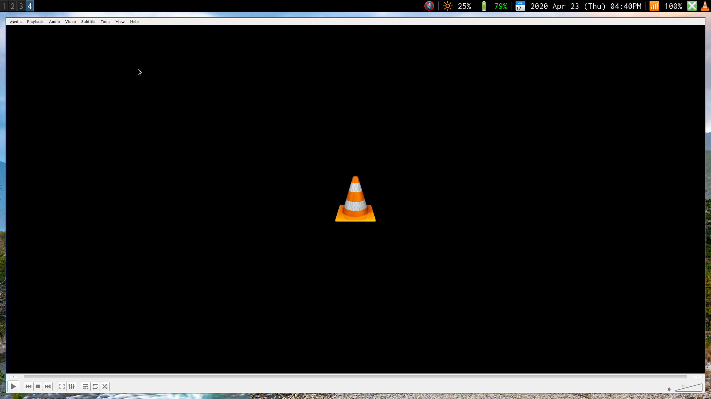

# Brightness status bar in [larbs](https://github.com/LukeSmithxyz/LARBS)

Make the following configurations in your system on which larbs is installed. To set a brightness status bar.


#### ScreenShots




## Set .config/i3blocks/config

Add the following code in the file ./config/i3blocks/config


```
#PATH .config/i3blocks/config

# By Abdhesh Nayak
# Created 2020 Apr 29

[brightness]
interval=once
command=brightness
signal=10
label=🔆

```

## Put a file .local/bin/statusbar/brightness

This file present in this repository download and put in the given path.

```
#!~/.local/bin/sh

# By Abdhesh Nayak
# Created 2020 Apr 29

File_Name="/sys/class/backlight/intel_backlight/brightness"
x=$(cat $File_Name)
((x=x/75))
printf " %s%s%%\\n" "$x"
label=🔆

```

## Note:

```
File_Name="/sys/class/backlight/intel_backlight/brightness"
```
Check this file first if it is present in your system then it will work else replace this path in 

```
.local/bin/statusbar/brightness
```

By finding the brightness file in your system may present in 

```
"/sys/class/......."
```
## Author
* **Abdhesh Nayak** - [Github](https://github.com/abdheshnayak), [LinkedIn](https://www.linkedin.com/in/abdhesh-nayak/)

See also the list of [contributors](contributors) who participated in this project.
